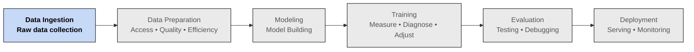

# The ML Pipeline

## 🇪🇸 Spanish

- **Data Ingestion:** Consiste en recolectar los datos en bruto que servirán como base para el modelo. Es el punto de partida donde se accede a las fuentes de datos relevantes.
- **Data Preparation:** Los datos rara vez vienen listos para usarse. En esta etapa se limpian, transforman y formatean para garantizar su calidad y compatibilidad con el modelo de Machine Learning. Generalmente es la fase que consume más tiempo del proceso.
- **Modeling:** Aquí se diseña el modelo, definiendo su arquitectura, los algoritmos a utilizar, las capas (en redes neuronales), y otros parámetros clave.
- **Training:** Es el proceso de entrenar el modelo con los datos preparados, ajustando los parámetros (pesos y sesgos) mediante técnicas de aprendizaje automático.
- **Evaluation:** En esta etapa se evalúa el rendimiento del modelo, comparando sus predicciones con los resultados reales y utilizando datos que no ha visto antes para medir su capacidad de generalización.
- **Deployment:** Finalmente, el modelo se lleva a un entorno de producción, donde puede ser usado por aplicaciones reales. Aquí también se realiza su monitoreo y mantenimiento para asegurar un funcionamiento continuo y confiable.

## 🇬🇧 English version

- **Data Ingestion:** This stage involves collecting the raw data that will serve as the foundation for the model. It focuses on accessing and gathering relevant data sources.
- **Data Preparation:** Data is rarely ready for use. In this phase, it is cleaned, transformed, and formatted to ensure quality and compatibility with the ML model. It is often the most time-consuming part of the entire process.
- **Modeling:** The model is designed and defined in this stage — choosing the architecture, algorithm, number of layers (for neural networks), and key hyperparameters.
- **Training:** The model is trained with the prepared data, adjusting its parameters (weights and biases) through optimization and learning techniques.
- **Evaluation:** The trained model is evaluated by comparing its predictions to actual results and testing it on unseen data to measure its generalization ability.
- **Deployment:** Finally, the model is deployed into a production environment, making it available for real-world use. Continuous monitoring and maintenance ensure its reliability and performance over time.
